# Artesanos.ar

Marketplace para artesanos argentinos. Catálogo público de piezas, chat directo entre clientes y artesanos, reseñas, calendario de ferias, moderación admin, plan freemium con cupones y piezas destacadas.

## Estructura del repo

```
.
├── blogArtesanos/          ← Backend Spring Boot 3.5 + MySQL
└── blog-artesanos-front/   ← Frontend React 19 + Vite
```

Cada carpeta tiene su propio `README.md` con setup específico.

## Stack

- **Backend**: Spring Boot 3.5, Java 21, MySQL 8, JPA/Hibernate, JWT auth, Bucket4j (rate limiting), Spring Security
- **Frontend**: React 19, Vite, React Router, Axios
- **Servicios**: Cloudinary (imágenes/video), Gmail SMTP

## Arranque rápido (dev)

### Backend
```bash
cd blogArtesanos
cp .env.example .env       # editar con tus credenciales
mvn spring-boot:run
```
Levanta en `http://localhost:8080`.

### Frontend
```bash
cd blog-artesanos-front
npm install
npm run dev
```
Levanta en `http://localhost:5173`.

## Deploy a producción

Ver **`blogArtesanos/DEPLOY.md`** para la guía completa (Docker, hosting providers, backup, monitoreo, checklist pre-prod).

## Features destacadas

- 🛒 Catálogo público con filtros por oficio
- 💬 Chat directo cliente↔artesano con polling
- ⭐ Reseñas, likes, ranking semanal/mensual con premios configurables
- 🎟 Cupones de descuento aplicables a piezas específicas
- 📅 Calendario de ferias con moderación
- 🛡 Panel admin: moderación, reportes, feedback, auditoría
- 🔔 Notificaciones in-app
- ★ Plan Premium con piezas destacadas, video por pieza, posición prioritaria

## Seguridad

- JWT con secret en env var
- Rate limiting en endpoints sensibles (login 5/5min, registro/recovery 3/h)
- CORS configurable
- Headers de seguridad (HSTS, X-Frame-Options, etc.)
- BCrypt + roles + auditoría admin


## Imagenes
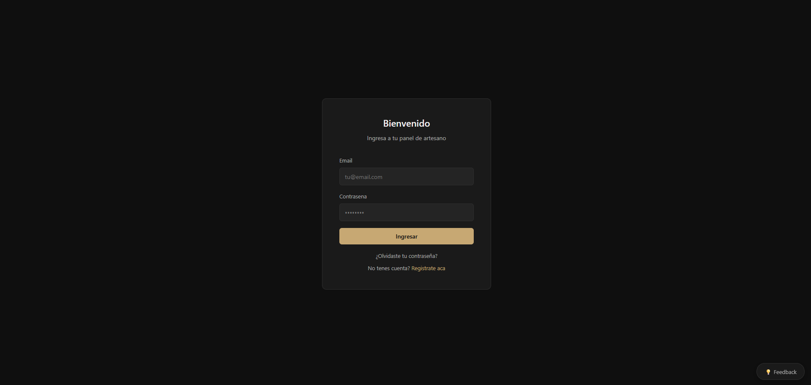
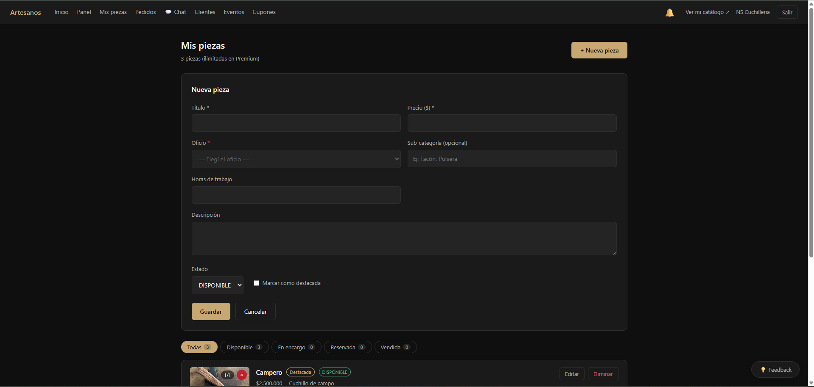
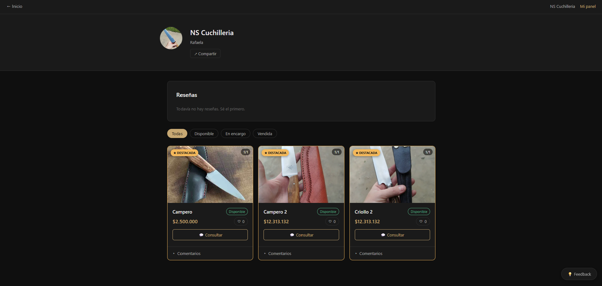
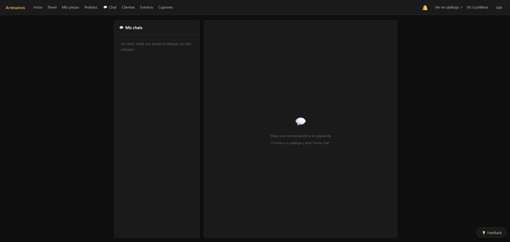
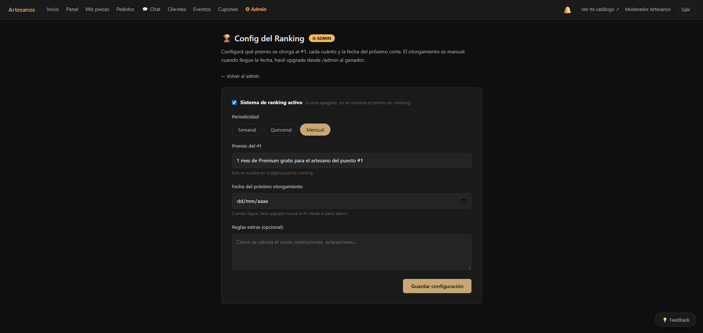
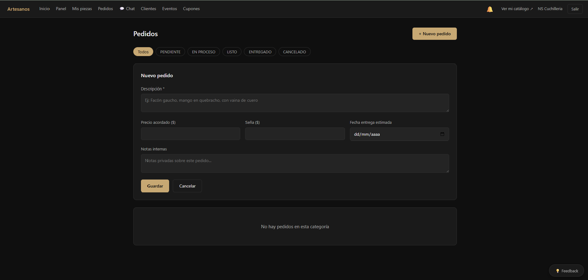
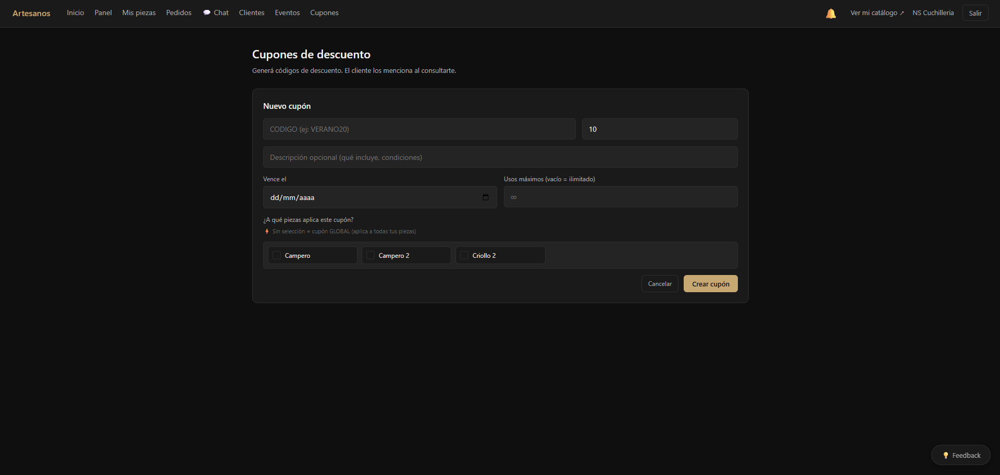
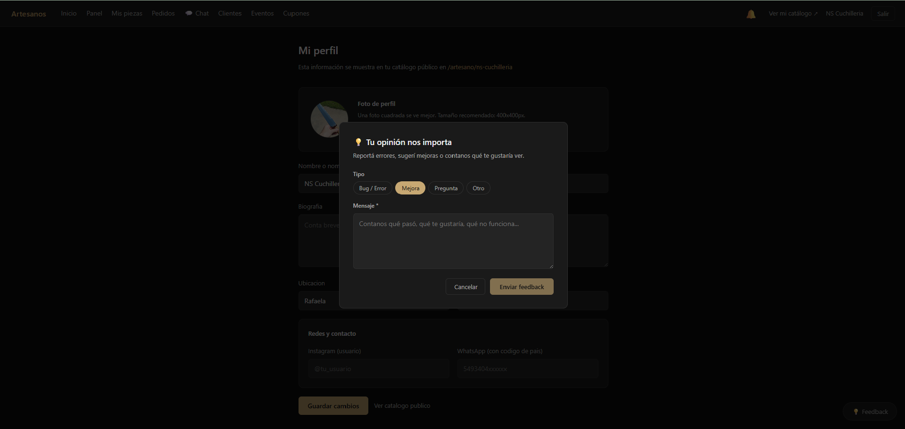
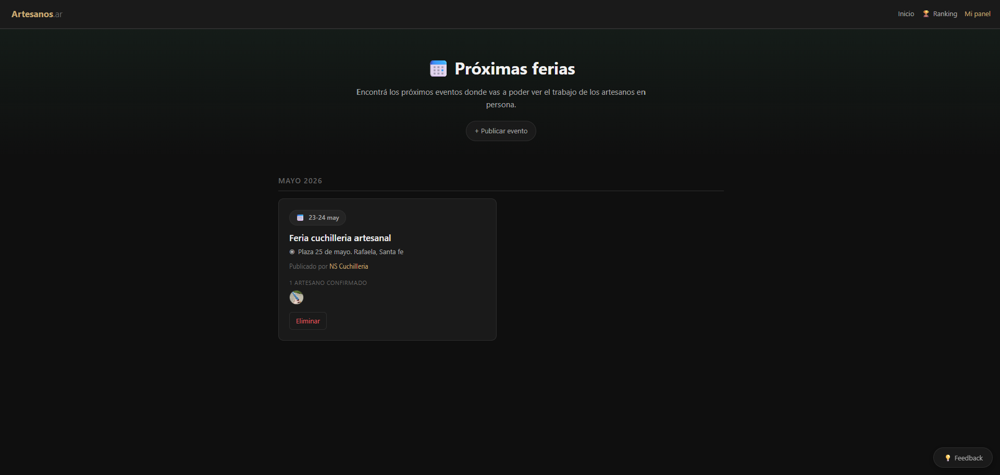
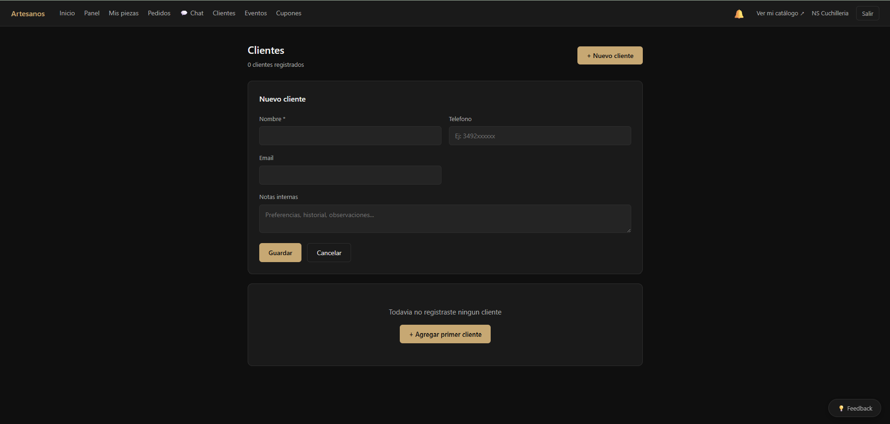
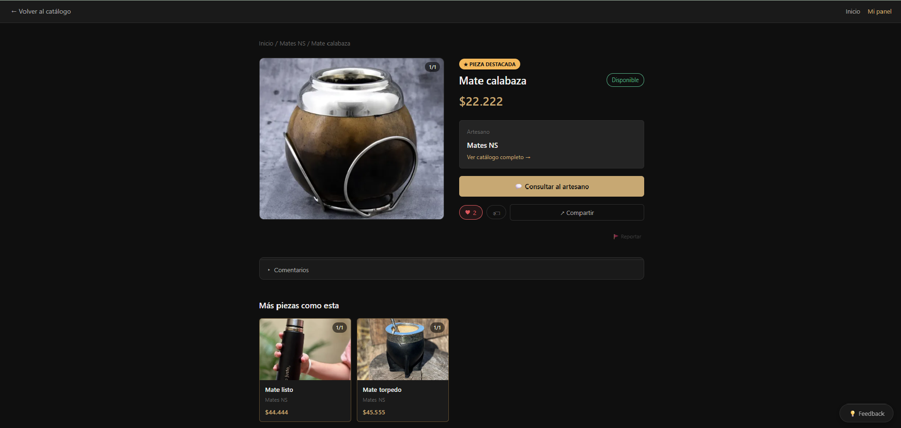
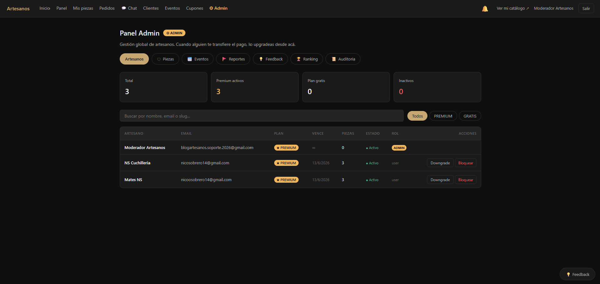
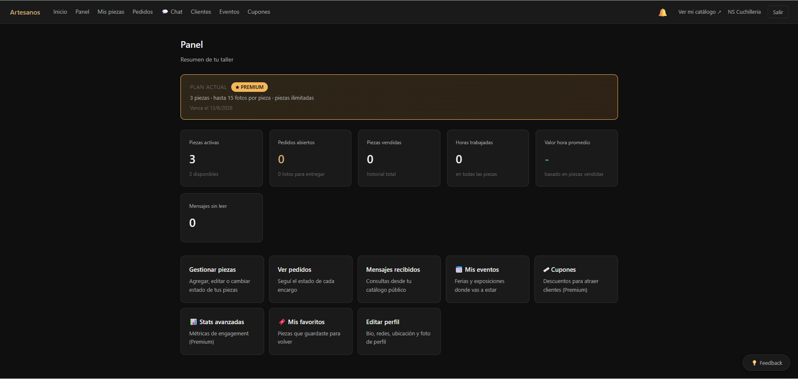
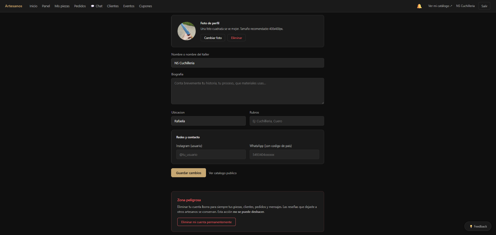
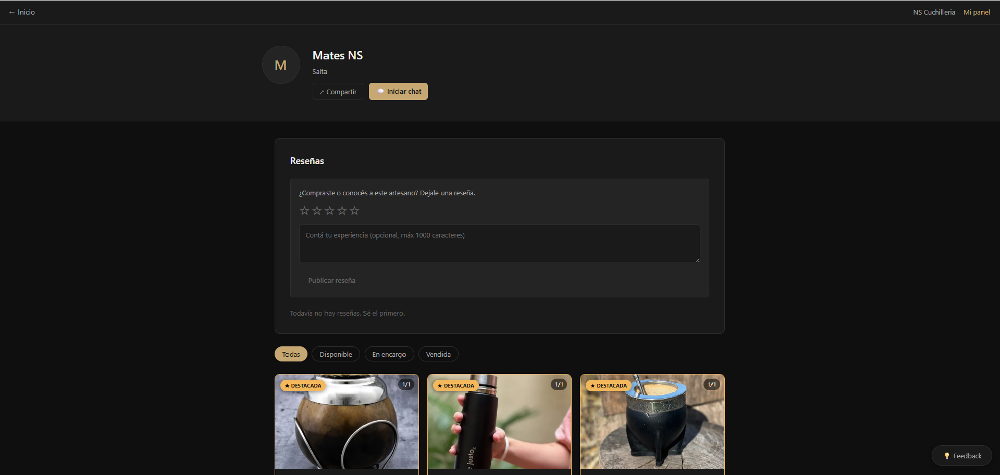
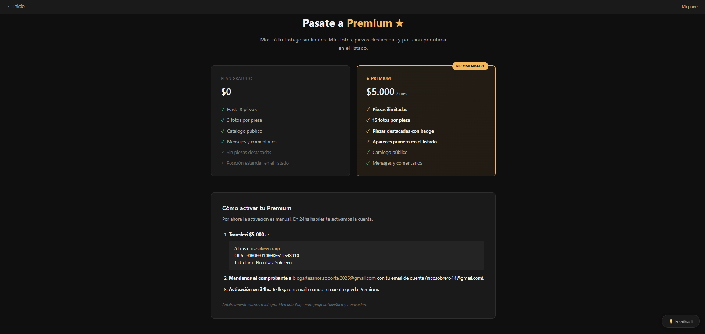
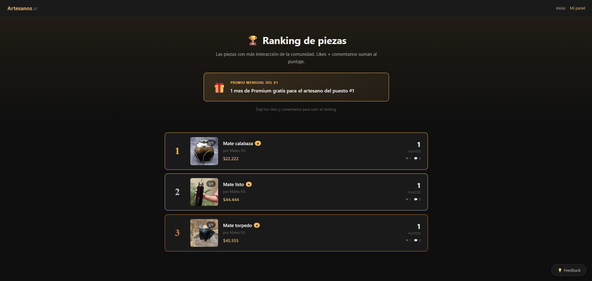


## Licencia

Proyecto personal. Todos los derechos reservados.
